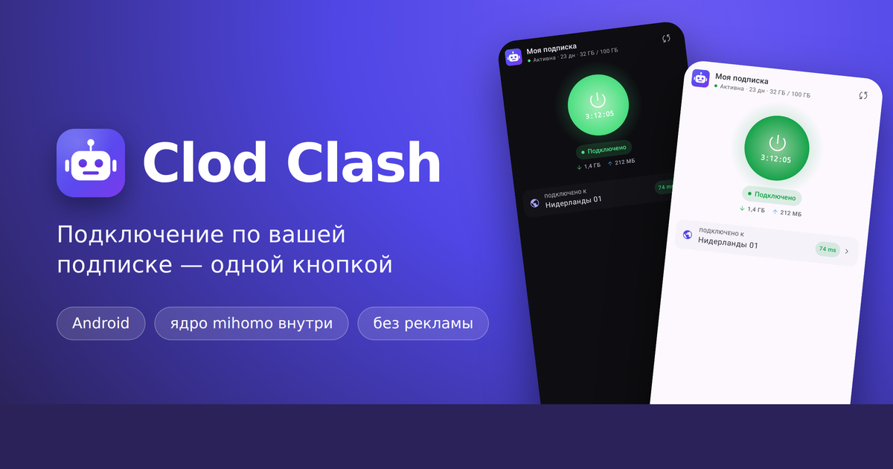

<p align="center">
  
</p>

<h1 align="center">Clod Clash для Android</h1>

<p align="center">
  <a href="https://mrvibecodic.github.io/clod-clash-android/ru/docs">Документация</a> ·
  <a href="https://mrvibecodic.github.io/clod-clash-android/ru/download">Скачать APK</a> ·
  <a href="https://mrvibecodic.github.io/clod-clash-android/en/docs">English docs</a> ·
  <a href="./PRIVACY_POLICY.ru.md">Конфиденциальность</a>
</p>

<p align="center">
  <a href="https://t.me/+2lmP1yhxpCE3MDcy">
    
  </a>
  &nbsp;
  <a href="https://t.me/+8BJQXYXYLqM4YWYy">
    
  </a>
</p>

<p align="center">
  <b><a href="https://t.me/+2lmP1yhxpCE3MDcy">Группа</a></b> — новости и релизы
  · <b><a href="https://t.me/+8BJQXYXYLqM4YWYy">Чат</a></b> — вопросы, помощь и обсуждение
</p>

Android-клиент [Clod Clash](https://github.com/Mrvibecodic/clod-clash) — white-label клиента для
пользователей панели Remnawave. Десктопная версия (Windows / macOS / Linux) живёт в отдельном
репозитории, здесь только Android.

> **Статус: ранняя разработка.** База — ClashMetaForAndroid v2.11.32 с сохранённой историей,
> интерфейс целиком переписан на Jetpack Compose, заголовки подписки Remnawave разбираются
> наравне с десктопом.

## На чём это основано

| Что | Откуда | Лицензия |
|---|---|---|
| **Оболочка приложения**: `VpnService`, мост Go↔Kotlin, сервисный слой, хранилище профилей, сборка ядра, CI | [MetaCubeX/ClashMetaForAndroid](https://github.com/MetaCubeX/ClashMetaForAndroid) — база репозитория, история сохранена | GPL-3.0 |
| **Ядро** | [Mrvibecodic/clod-core](https://github.com/Mrvibecodic/clod-core), ветка `android` — наш форк стабильного [MetaCubeX/mihomo](https://github.com/MetaCubeX/mihomo) с utls `v1.9.0-mod-meta`, общими правками проб из ветки `main` и патчами Android, которые лежат там обычными коммитами; подключено submodule'ом (`.gitmodules`: `branch = android`); сборка в CI всегда берёт голову ветки `android` (`--remote`), гитлинк в клиенте не поднимается. `replace` для utls и protobuf CI переносит из `go.mod` ядра в оба модуля клиента, версии остальных зависимостей Go поднимает сам (`GOFLAGS=-mod=mod`) | GPL-3.0 |
| **Интерфейс** | наш, Jetpack Compose; разметок CMFA не осталось | GPL-3.0 |
| **Подписки и заголовки Remnawave** | наши: заголовки разбирает Go (`core/…/config/panel/`), решения по подписке — Kotlin (`service/…/subscription/`). Правила те же, что в [десктопном клиенте](https://github.com/Mrvibecodic/clod-clash), код отдельный | GPL-3.0 |

Отдельная благодарность авторам [ClashForAndroid](https://github.com/Kr328/ClashForAndroid)
(Kr328) — с него начинался апстрим, и его код до сих пор составляет заметную часть оболочки.

Список лицензий сторонних компонентов — в [NOTICE](NOTICE).

## Ядро

Сейчас в приложении — Clod Core, наш форк стабильного mihomo v1.19.31, с пятью правками для
Android: проверки узлов не пишут провал, пока сеть переключается или процесс спал; сброс
мультиплекс-сессий узлов при смене сети; ожидаемый код ответа у select-групп; отказ от редиректа
`https` → `http`; сборка мусора после перехода ядра в рабочий режим.

[Clod Core](https://github.com/Mrvibecodic/clod-core) — наш форк стабильного Mihomo, ветка
`android`, встроен в приложение. Кроме правок выше, в нём:

* utls v1.9.0-mod-meta — отпечатки Firefox 148 и Safari 26.3 с постквантовым ключом;
* узел считается мёртвым только после второй неудачной проверки (вторая идёт через секунду
  после зависшей первой); закрытый порт, нет имени, не тот код — мёртв сразу;
* штраф автовыбора нестабильным узлам — четверть тайм-аута за каждый провал в трёх последних
  проверках;
* узел из нескольких групп проверяется один раз за раунд, узлы одного сервера — с шагом 250 мс;
* наборы правил, провайдеры и geo-базы записываются через временный файл.

## Благодарности

Проектам, у которых мы подсмотрели продуктовые решения. Чужого кода в них мы не брали —
только форматы, приёмы и подходы:

* [Prizrak-Box](https://github.com/legiz-ru/Prizrak-Box) от legiz-ru — цветовая разметка
  `#RRGGBB` в объявлениях и синоним `global-mode: false` для замка режима;
* [koala-clash](https://github.com/coolcoala/koala-clash) и
  [KoalaClash-Android](https://github.com/coolcoala/KoalaClash-Android) от coolcoala — формат
  User-Agent «имя/версия» и заголовки опознания устройства;
* [FlClash](https://github.com/chen08209/FlClash) от chen08209 и его форк
  [FlClashX](https://github.com/pluralplay/FlClashX) от pluralplay — подмена хоста подписки
  на другой домен и состав заголовков.

## Настройка панели

В **Subscription response rules** Remnawave нужно правило: регулярное выражение `^clodclash`
(регистр не важен), формат ответа **MIHOMO** — одно на обе платформы. Чтобы доходили описания
серверов, в том же правиле добавьте `^ClodClash/` в
`responseModifications.additionalExtendedClientsRegex`. Пример правила и проверка — на странице
[«Настройка панели»](https://mrvibecodic.github.io/clod-clash-android/ru/docs/provider).

## Заголовки подписки

Приложение отправляет `User-Agent: ClodClash/<версия> (Android)`, `Accept: */*` и, пока включено
«Опознавать это устройство», `x-hwid`, `x-device-os`, `x-ver-os`, `x-device-model`. Стандартные
заголовки ответа — на странице
[«Заголовки подписки»](https://mrvibecodic.github.io/clod-clash-android/ru/docs/headers).

Собственные заголовки `clod-*`, которые понимает Android (подробно — на странице
[«Заголовки clod-*»](https://mrvibecodic.github.io/clod-clash-android/ru/docs/clod-headers)):

| Заголовок | Значение | Что делает |
| --- | --- | --- |
| `clod-portal-url` | ссылка `https://` | кнопка «Личный кабинет» |
| `clod-bot-url` | ссылка `https://`, `tg:` или `mailto:` | кнопка «Бот» |
| `clod-monitor-url` | ссылка `https://` | кнопка «Мониторинг» |
| `clod-guide-url` | ссылка `https://` | кнопка «Инструкция» |
| `clod-announce` | текст | постоянное объявление; важнее `announce` |
| `clod-promo` | текст | промо-баннер, который можно закрыть |
| `clod-promo-url` | ссылка `https://` | куда ведёт нажатие на промо |
| `clod-lock-mode` | `true`, `lock` или `false` | запирает режим на `mode` из шаблона: `true` — пока подписка обновляется, `lock` — без срока |
| `clod-ping` | `A/B` в мс, например `150/300` | границы цвета задержки; без заголовка — `200/400` |
| `clod-disable-ping` | только `true` | галочка или крестик вместо миллисекунд |
| `clod-show-0hosts` | `true` или `false` | показывать узлы-заглушки панели как есть |
| `clod-16-20-check` | только `true` | проверка 16–20: режется ли трафик через сервер в сети пользователя; пометки «режется» и «не отвечает» |
| `clod-new-sub` | домен, например `backup.example.com` | запасной адрес подписки (домен): `https://<домен>` и путь основного, если основной не ответил |
| `clod-move-sub` | только `true`, вместе с `clod-new-sub` | перевести всех на запасной адрес: проверив его, приложение навсегда меняет адрес подписки |

## Лицензия

GPL-3.0, как и у всех проектов выше. См. [LICENSE](LICENSE).

## Апстрим

Обновления вливаются из апстрима штатным мерджем:

```bash
git remote add upstream https://github.com/MetaCubeX/ClashMetaForAndroid.git
git fetch upstream
git merge upstream/main
```

Репозиторий намеренно сделан не GitHub-форком, а зеркалом с полной историей: так работают
Actions, репозиторий можно сделать приватным, и он не висит в fork-network апстрима.
На возможность вливать апстрим это не влияет.
